# nocloud-init Workflow

## Overview

`nocloud-init` runs as a `oneshot` systemd service at boot, before `systemd-networkd` starts. It has two distinct top-level modes: **`--install`** (one-time setup) and the normal **boot run** (applies cloud-init configuration on every boot).

## Flowchart

```mermaid
flowchart TD
    START([nocloud-init starts]) --> FLAGS[Parse CLI flags\n--help / --version / --install / --verbose / --strict]

    FLAGS --> WHICH{Which flag?}

    WHICH -- "--help" --> HELP[Print help text]
    HELP --> EXIT0([Exit 0])

    WHICH -- "--version" --> VER[Print version / build info]
    VER --> EXIT0b([Exit 0])

    WHICH -- "--install" --> CHKPROG[service.CheckPrograms\nVerify chpasswd + ssh-keygen on PATH]
    CHKPROG --> CHKPROG2{OK?}
    CHKPROG2 -- No --> EXIT1a([Exit 1])
    CHKPROG2 -- Yes --> CHKDIR[service.CheckDirectories\nVerify /etc/systemd/system\n+ /etc/systemd/network exist]
    CHKDIR --> CHKDIR2{OK?}
    CHKDIR2 -- No --> EXIT1b([Exit 1])
    CHKDIR2 -- Yes --> INSTALL[service.InstallService\nRender systemd unit template\nWrite nocloud-init.service\nsystemctl enable]
    INSTALL --> EXIT0c([Exit 0])

    WHICH -- "no flag / boot run" --> TMPDIR[Create temp mount directory\nos.MkdirTemp]

    TMPDIR --> MOUNT[mount.MountISO\nScan /dev/disk/by-label/ for CIDATA\nMount as iso9660 → fallback vfat]
    MOUNT --> MOUNTED{CIDATA found?}

    MOUNTED -- ErrCIDATANotFound --> NOCIDATA[Log: no CIDATA device — skipping]
    NOCIDATA --> EXIT0d([Exit 0 — nothing to do])
    MOUNTED -- "other error" --> EXIT1c([Exit 1])

    MOUNTED -- "mounted OK" --> READUD[Read user-data file\nfrom mount point]
    READUD --> UDEXISTS{File exists?}

    UDEXISTS -- No --> SKIPUD[Skip user-data]
    UDEXISTS -- "read error" --> EXIT1d([Exit 1])
    UDEXISTS -- Yes --> CCHDR{"#cloud-config\nheader?"}

    CCHDR -- No --> WARNUD[Warn: unsupported format\nSkip user-data]
    CCHDR -- Yes --> PARSEUD[types.UnmarshalUserData\nYAML / JSON → UserData struct\nhostname, fqdn, user, password,\nmanage_etc_hosts, chpasswd]
    PARSEUD --> PARSEUD2{Parse OK?}
    PARSEUD2 -- No --> EXIT1e([Exit 1])

    PARSEUD2 -- Yes --> READMD
    SKIPUD --> READMD
    WARNUD --> READMD

    READMD[Read meta-data file] --> MDEXISTS{File exists?}
    MDEXISTS -- No --> SKIPMD[Skip meta-data]
    MDEXISTS -- "read error" --> EXIT1f([Exit 1])
    MDEXISTS -- Yes --> PARSEMD[types.UnmarshalMetaData\nYAML / JSON → MetaData struct\ninstance-id, local-hostname]
    PARSEMD --> PARSEMD2{Parse OK?}
    PARSEMD2 -- No --> EXIT1g([Exit 1])

    PARSEMD2 -- Yes --> RESOLVEHN
    SKIPMD --> RESOLVEHN

    RESOLVEHN["Resolve effective hostname\nPrecedence:\n1. user-data.hostname\n2. meta-data.local-hostname\n3. meta-data.hostname\n4. empty — skip"] --> VALIDATEHN{Hostname / FQDN\nvalid RFC format?}

    VALIDATEHN -- No --> EXIT1h([Exit 1])
    VALIDATEHN -- "valid or empty" --> SETHOSTNAME{Hostname\nresolved?}

    SETHOSTNAME -- Yes --> UPDATEHN[system.UpdateHostname\nWrite /etc/hostname\nsethostname syscall\nWrite /etc/machine-info]
    SETHOSTNAME -- No --> CHKPW

    UPDATEHN --> CHKPW{user + password\nfields set?}

    CHKPW -- No --> UPDATEHOSTS
    CHKPW -- Yes --> VALIDATEPW{Password is\ncrypt hash\n'$id$...'?}
    VALIDATEPW -- No --> EXIT1i([Exit 1])
    VALIDATEPW -- Yes --> UPDATEPW[system.UpdatePassword\nPipe 'user:hash' to chpasswd -e]
    UPDATEPW --> UPDATEHOSTS

    UPDATEHOSTS[system.UpdateHostsFile\nUpdate /etc/hosts 127.0.1.1 entry] --> MANAGEHOSTS{manage_etc_hosts\n+ hostname set?}
    MANAGEHOSTS -- No --> READNC
    MANAGEHOSTS -- Yes --> WRITEHOSTS["Rewrite /etc/hosts\n127.0.1.1 [fqdn] hostname\nAtomic temp-file rename"]
    WRITEHOSTS --> READNC

    READNC[Read network-config file] --> NCEXISTS{File exists?}
    NCEXISTS -- No --> SKIPNC[Skip network config]
    NCEXISTS -- "read error" --> EXIT1j([Exit 1])
    NCEXISTS -- Yes --> PARSENC[types.UnmarshalNetworkConfig\nYAML / JSON → NetworkConfig struct]
    PARSENC --> PARSENC2{Parse OK?}
    PARSENC2 -- No --> EXIT1k([Exit 1])

    PARSENC2 -- Yes --> CLEANNC[network.GenerateSystemdNetworkConfig\nDelete stale 10-cloud-init-* files\nfrom /etc/systemd/network]
    CLEANNC --> NCVER{network-config\nversion?}

    NCVER -- "v1" --> V1[generateV1NetworkConfig\nFor each 'physical' entry:\n  Validate iface name + MAC\n  Write 10-cloud-init-*.network\n  Write 10-cloud-init-*.link if MAC set\nCollect nameserver entries\nUpdate /etc/resolv.conf if any]
    NCVER -- "v2" --> V2[generateV2NetworkConfig\nFor each ethernet entry:\n  Validate iface name + MAC\n  Write 10-cloud-init-*.network\n  Write 10-cloud-init-*.link if MAC set\nCollect nameservers per-interface\nUpdate /etc/resolv.conf if any]
    NCVER -- "unsupported" --> EXIT1l([Exit 1])

    V1 --> SSHKEYS
    V2 --> SSHKEYS
    SKIPNC --> SSHKEYS

    SSHKEYS[system.CheckAndGenerateSSHKeys\nssh-keygen -A\nGenerates any missing host key types] --> SSHKEYS2{OK?}
    SSHKEYS2 -- No --> EXIT1m([Exit 1])
    SSHKEYS2 -- Yes --> UNMOUNT[Unmount ISO\nmount.UnmountISO\nRemove temp directory]
    UNMOUNT --> SUCCESS([Exit 0 — completed successfully])
```

## Key Design Properties

| Property | Detail |
|---|---|
| **Stateless** | Runs from scratch on every boot; no state file or first-boot gating |
| **No CIDATA = no-op** | `ErrCIDATANotFound` causes a clean exit without modifying the system |
| **Atomic writes** | All file writes use a temp-file + `rename(2)` to prevent partial reads |
| **Input validation** | Hostname, MAC, IP, domain, and password format are validated before use |
| **Precedence** | `user-data.hostname` > `meta-data.local-hostname` > `meta-data.hostname` |
| **Network files** | Stale `10-cloud-init-*` files are cleaned before each run |
| **resolv.conf** | Skipped (no error) when the file is a symlink, e.g. to `systemd-resolved` |
